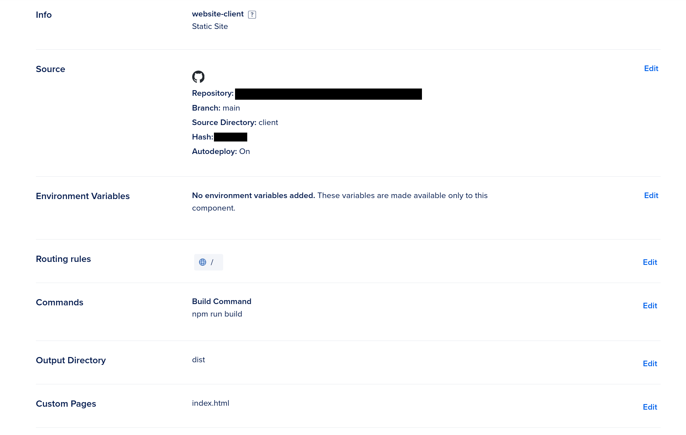

Zero to Production in Rust by Luca Palmieri is a fantastic book to start exploring rust and RESTful api programming.
The book excellently remains on topic by focusing almost exclusively on the server side development of a full stack newsletter
website, except where absolutely necessary.

This repo provides a basic node.js with vite.js front end application that you can use as a static site for your zero2prod application.

These are the settings I used to host my static site.

I won't include a screen shot of my api webservices settings.
Though I'll add that you should set up routing rules so that your static site
will route requests to your webservice.

Also, you'll need to add another environment variable to use your email api key.
see this github link for details: https://github.com/LukeMathWalker/zero-to-production/issues/178

Note: the .env.development variables are based on my local nginx configuration. You may need to alter this file to use it locally
Note: this repo will not provide a way to send emails via post mark through your local machine.

Please visit my versoin of this book at wavemotiongames.com to see how I've implemented the book and what features I've added :)
